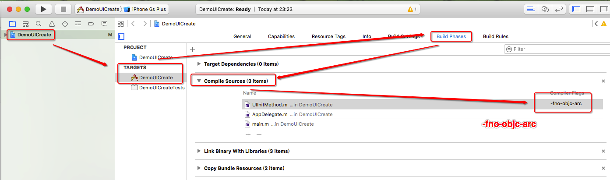

# SYUIInitMethod
UI控件初始化方法集成封装类

* 使用介绍
  * 自动导入：使用命令`pod 'SYUIInitMethod'`导入到项目中
  * 手动导入：或下载源码后，将源码添加到项目中
  
  
## 使用方法
~~~ javascript
// 1 导入头文件 
#import "SYUIInitMethod.h"
~~~ 
~~~ javascript
// 初始化使用UI控件 
// 创建view
UIView *view = InsertView(nil, CGRectMake(0.0, 0.0, CGRectGetWidth(self.view.bounds), 250.0), [UIColor greenColor], 5.0, [UIColor orangeColor], 5.0);

// 创建tableview
UITableView *tableview = InsertTableView(self.view, self.view.bounds, self, self, UITableViewStylePlain, UITableViewCellSeparatorStyleSingleLine);

// 创建label
InsertLabel(view, CGRectMake(10.0, 20.0, (self.view.bounds.size.width - 10.0 * 2), 20.0), NSTextAlignmentLeft, @"使用自定义方法创建label", [UIFont systemFontOfSize:10.0], [UIColor blackColor], NO);

// 创建AlertController
InsertAlertController(self, UIAlertControllerStyleAlert, @"温馨提示", @"alertController view视图", @[@"取消", @"知道了", @"你惨了", @"你赢了"], ^(int indexButton, NSString *titleButton) {
    if ([titleButton isEqualToString:@"取消"])
    {
        NSLog(@"你点击了第 %@ 个按钮，标题是 %@", @(indexButton), titleButton);
    }
    else if ([titleButton isEqualToString:@"知道了"])
    {
        NSLog(@"你点击了第 %@ 个按钮，标题是 %@", @(indexButton), titleButton);
    }
    else if ([titleButton isEqualToString:@"你惨了"])
    {
        NSLog(@"你点击了第 %@ 个按钮，标题是 %@", @(indexButton), titleButton);
    }
    else if ([titleButton isEqualToString:@"你赢了"])
    {
        NSLog(@"你点击了第 %@ 个按钮，标题是 %@", @(indexButton), titleButton);
    }
});
~~~ 

## 注意事项：
SYUIInitMethod类是MRC内存管理模式，如果项目是ARC内存管理模式，记得设置支持ARC模式。

## 效果图

# 修复完善
* 20190124
  * 版本号：1.2.1
  * 修改异常
  
  * 版本号：1.2.0
  * ARC内存管理模式

* 20190111
  * 版本号：1.1.2
  * 引入头文件设置
  * 刘海安全区域判断

* 20180918
  * 版本号：1.0.3
  * 功能完善

* 20171017
  * 版本号：1.0.1
  * 源码与示例分离
  
* 20170421
  * SYUIInitMethod方法完善按钮实例化方法
  * UIButton添加高亮图标属性
  * UIBarButtonItem添加高亮图标属性

