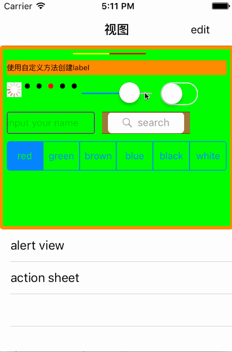

# SYUIInitMethod
UI控件初始化方法集成封装类

* 使用介绍
  * 自动导入：使用命令`pod 'SYUIInitMethod'`导入到项目中
  * 手动导入：或下载源码后，将源码添加到项目中
  
  
## 使用方法
~~~ javascript
// 1 导入头文件 
#import "SYAutoSizeCGRect.h"
~~~ 

~~~ javascript
// 初始化使用UI控件 
// 创建view
UIView *view = InsertView(nil, CGRectMake(0.0, 0.0, CGRectGetWidth(self.view.bounds), 250.0), [UIColor greenColor], 5.0, [UIColor orangeColor], 5.0);

// 创建tableview
UITableView *tableview = InsertTableView(self.view, self.view.bounds, self, self, UITableViewStylePlain, UITableViewCellSeparatorStyleSingleLine);

// 创建label
InsertLabel(view, CGRectMake(10.0, 20.0, (self.view.bounds.size.width - 10.0 * 2), 20.0), NSTextAlignmentLeft, @"使用自定义方法创建label", [UIFont systemFontOfSize:10.0], [UIColor blackColor], NO);

// 创建AlertController
InsertAlertController(self, UIAlertControllerStyleAlert, @"弹窗", @"提示信息与编辑", @[@"大兄弟在哪里", @"小老弟在哪里"], @[@"大兄弟", @"小老弟", @"确定", @"取消"], ^(int index, NSString *title, NSArray *textFields) {
        if (textFields.count > 0) {
            for (UITextField *textfield in textFields) {
                NSLog(@"index = %@, title = %@, text = %@", @(index), title, textfield.text);
            }
        } else {
            NSLog(@"index = %@, title = %@", @(index), title);
        }
});
~~~ 

~~~ javascript
// 适配初始化
UIAutoSize.isAuto = NO; // 不进行自适配

UIAutoSize.layoutType = UIAutoLayoutTypeiPhone5; // 适配机型标准iPhon5/6/7
~~~

## 注意事项：
SYUIInitMethod类是ARC内存管理模式。

## 效果图

# 修复完善
* 20190912
  * 版本号：1.2.5
  * 优化
    * 新增适配
      * 初始化设置：是否适配`isAuto`、适配机型标准`layoutType`
      * 适配属性：比例`layoutScale`

* 20180925
  * 版本号：1.2.4
  * 优化 UIAlertController
  
  * 版本号：1.2.3
  * 新增 InsertCollectionView

* 20190124
  * 版本号：1.2.2
  * 修改异常

  * 版本号：1.2.0
  * ARC内存管理模式

* 20190111
  * 版本号：1.1.2
  * 引入头文件设置
  * 刘海安全区域判断

* 20180918
  * 版本号：1.0.3
  * 功能完善

* 20171017
  * 版本号：1.0.1
  * 源码与示例分离
  
* 20170421
  * SYUIInitMethod方法完善按钮实例化方法
  * UIButton添加高亮图标属性
  * UIBarButtonItem添加高亮图标属性

